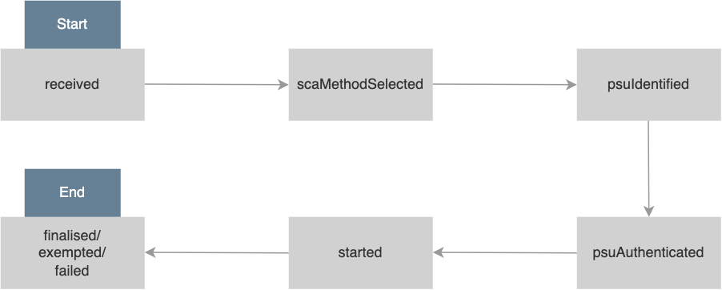

## Configuring SCA Status for NextGenPSD2

!!! info
    This is only available as a WSO2 Update from **WSO2 Open Banking Identity Server Berlin Toolkit Level 1.0.0.6** and
    **WSO2 Open Banking API Manager Berlin Toolkit Level 1.0.0.6** onwards. For more information on updating, see
    [Getting WSO2 Updates](../install-and-setup/setting-up-servers.md#getting-wso2-updates).

A set of new statuses to the NextGenPSD2 authorisation object are introduced with this update. The following diagram shows the new life cycle of a NextGenPSD2 consent:



??? tip "Click here to see a brief explanation of each authorisation status..."

     | SCA Status | Description |
     | ------------- | ----------- |
     | `received` | This is the first status that gets assigned to the authorisation resource. This indicates that an authorisation resource has been created successfully. |
     | `scaMethodSelected` | This is the first status that gets assigned to the authorisation resource if only a single SCA method is available and is selected implicitly.  |
     | `psuIdentified` | This status gets assigned to the authorisation resource after the PSU related to the particular authorisation resource is identified through the Update PSU Data request or if the PSU has been identified by any other means (For example, the PSU-ID header). |
     | `psuAuthenticated` | This status gets assigned to the authorisation resource when the PSU has successfully authenticated using a password. |
     | `started` | This status gets assigned to the authorisation resource after a successful login of the PSU in the authorisation web page and when the addressed SCA routine has been started. |
     | `finalised`| This indicates that the SCA routine has been finalised successfully. This is a final status of the authorisation resource. |
     | `exempted`| This indicates that the SCA was exempted for the related transaction, and the related authorisation is successful. This is a final status of the authorisation resource. |
     | `failed`| This indicates that the SCA routine failed. This is a final status of the authorisation resource. |

The consent management implementation is updated according to this. If you need to enforce Strong Customer Authentication (SCA) 
for a particular consent when authorising, several SCA status updates are required to be done during the authorisation flow. 
The authorisation status can be updated from the adaptive authentication script as shown below:

```
OBAuthenticationWorker(context, {}, "<<new_status>>");
```

!!!info
    See the [Open Banking Authentication Worker documentation](https://ob.docs.wso2.com/en/latest/develop/authentication-worker/) for more information.

WSO2 Open Banking Accelerator provides a simple authentication flow with basic authentication to facilitate the authentication. 
Additionally, SCA and SCA exemptions can be configured according to your requirements.

For example, if you want SMS OTP or any other authenticator supported by WSO2 Identity Server as the second-factor authentication, 
you can configure it using WSO2 Authenticators by adding that according to the [Consumer Authentication documentation](https://ob.docs.wso2.com/en/latest/learn/consumer-authentication/).

!!!note 
    Refer to the [IS Connectors page](https://store.wso2.com/store/assets/isconnector/list) to see the authenticators supported by the WSO2 Identity Server.

Adding these authenticators will result in different adaptive authentication scripts used in the deployment.

In addition, if you have an exemption mechanism (for example, a fraud detection component that are exempt from SCA), 
it should be called from the same adaptive authentication script.

This means the adaptive authentication script differs for each deployment, and where to place the above-mentioned status update calls varies accordingly.

Given below is the simple adaptive authentication script used in the Open Banking Accelerator.

```java
var psuChannel = "Online Banking";
var onLoginRequest = function (context) {
    publishAuthData(context, "AuthenticationAttempted", {
        psuChannel: psuChannel,
    });
    executeStep(1, {
        onSuccess: function (context) {
            OBAuthenticationWorker(context, {}, "psuAuthenticated");
            Log.info("Authentication Successful");
            publishAuthData(context, "AuthenticationSuccessful", {
                psuChannel: psuChannel,
            });
            OBAuthenticationWorker(context, {}, "finalised");
        },
        onFail: function (context) {
            Log.info("Authentication Failed");
            publishAuthData(context, "AuthenticationFailed", {
                psuChannel: psuChannel,
            });
            OBAuthenticationWorker(context, {}, "failed");
        },
    });
};
```

!!!note
    The above script does not include SCA or SCA exemption-related statuses since SCA is not enforced there.

Given below is a sample adaptive authentication script when the SMS Authenticator is engaged as the SCA.

```java
var psuChannel = "Online Banking";
var onLoginRequest = function (context) {
    publishAuthData(context, "AuthenticationAttempted", {
        psuChannel: psuChannel,
    });
    executeStep(1, {
        onSuccess: function (context) {
            OBAuthenticationWorker(context, {}, "psuAuthenticated");
            Log.info("Basic Authentication Successful");
            publishAuthData(context, "AuthenticationSuccessful", {
                psuChannel: psuChannel,
            });
            OBAuthenticationWorker(context, {}, "started");
            executeStep(2, {
                onSuccess: function (context) {
                    Log.info("Authentication Successful");
                    publishAuthData(context, "AuthenticationSuccessful", {
                        psuChannel: psuChannel,
                    });
                    OBAuthenticationWorker(context, {}, "finalised");
                },
                onFail: function (context) {
                    Log.info("Authentication Failed");
                    publishAuthData(context, "AuthenticationFailed", {
                        psuChannel: psuChannel,
                    });
                    OBAuthenticationWorker(context, {}, "failed");
                },
            });
        },
        onFail: function (context) {
            Log.info("Authentication Failed");
            publishAuthData(context, "AuthenticationFailed", {
                psuChannel: psuChannel,
            });
            OBAuthenticationWorker(context, {}, "failed");
        },
    });
};
```

If you have a mechanism to exempt SCA, you can call it. Based on the result, you can update statuses as in the following sample.

```java
var psuChannel = "Online Banking";
var onLoginRequest = function (context) {
    publishAuthData(context, "AuthenticationAttempted", {
        psuChannel: psuChannel,
    });
    executeStep(1, {
        onSuccess: function (context) {
            OBAuthenticationWorker(context, {}, "psuAuthenticated");
            Log.info("Basic Authentication Successful");
            publishAuthData(context, "AuthenticationSuccessful", {
                psuChannel: psuChannel,
            });
            OBAuthenticationWorker(context, {}, "started");
            var scaExempted = isSCAExempted(Context);
            if (scaExempted) {
                executeStep(2, {
                    onSuccess: function (context) {
                        Log.info("Authentication Successful");
                        publishAuthData(context, "AuthenticationSuccessful", {
                            psuChannel: psuChannel,
                        });
                        OBAuthenticationWorker(context, {}, "finalised");
                    },
                    onFail: function (context) {
                        Log.info("Authentication Failed");
                        publishAuthData(context, "AuthenticationFailed", {
                            psuChannel: psuChannel,
                        });
                        OBAuthenticationWorker(context, {}, "failed");
                    },
                });
            } else {
                OBAuthenticationWorker(context, {}, "exempted");
            }
        },
        onFail: function (context) {
            Log.info("Authentication Failed");
            publishAuthData(context, "AuthenticationFailed", {
                psuChannel: psuChannel,
            });
            OBAuthenticationWorker(context, {}, "failed");
        },
    });
};
```

!!!note
    The `scaMethodSelected` status is used when multiple SCA methods are available, and the TPP or user is given a chance 
    to select the authentication mechanism during consent initiation. Therefore, it is not a status that can be called from 
    the authentication script.

The adaptive authentication script is unique for each deployment. You should update it with the required status update calls 
referring to the above-mentioned samples. All the status changes outside the authentication script are already addressed in the implementation.