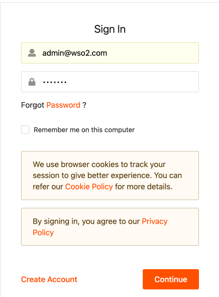
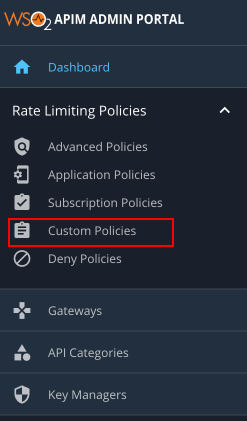
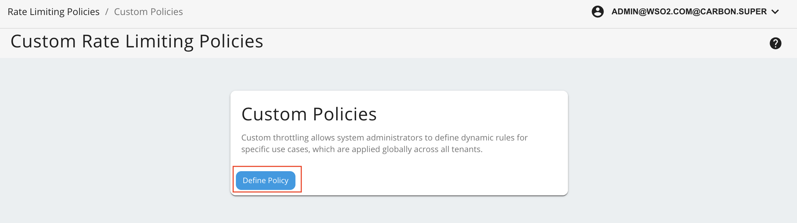
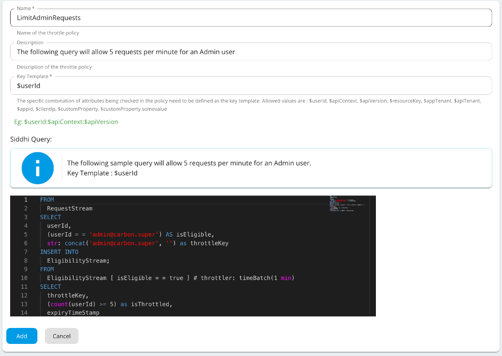

Custom throttling allows system administrators to define dynamic rules for specific use cases. When a custom throttling
policy is created, it is possible to define any policy you like. This feature is required when certain traffic thresholds
need to be freely throttled or rejected by Data Holders without impacting their performance or availability requirements.
[comment]: <> (For more details on setting the traffic thresholds, refer to [Consumer Data Standards - Traffic Thresholds](https://consumerdatastandardsaustralia.github.io/standards/#traffic-thresholds).)

In WSO2 Open Banking, the Traffic Manager component of the WSO2 Open Banking API Management module acts as the global 
throttling engine. This is based on the same technology as WSO2 Complex Event Processor (CEP), which uses the [Siddhi query 
language](https://docs.wso2.com/display/CEP420/SiddhiQL+Guide+3.1). Users are therefore able to create their own custom 
throttling policies by writing custom Siddhi queries.

!!! info
    The specific combination of attributes being checked in the policy needs to be defined as the key (also called the key 
    template). The key template usually includes a predefined format and a set of predefined parameters. It can contain a 
    combination of allowed keys separated by a colon (:), where each key must start with the prefix $. The following keys 
    can be used to create custom throttling policies:
    ```xml
    $customProperty.accountId:$customProperty.consentId:$userId:$customProperty.consumerKey
    ```

This page explains how to deploy a custom throttling policy for the NextGenPSD2 XS2A Framework API.

1. Sign in to the Admin portal at `https://<APIM_HOST>:9443/admin` with administrator privileges.

     

2. Go to **Rate Limiting Policies** and select the **Custom Policies** tab.

     

3. To add a new policy, click **Define Policy**.

     

4. Enter the following policy details and click **Add**.

    ???tip "Click here to see the full list of Custom Throttling Policies..."
        | Policy Name         | Siddhi Query            |
        | -------------       | -------------           |
        | LimitAdminRequests  | `@From(eventtable='rdbms', datasource.name='WSO2OB_DB', table.name='OB_CONSENT')`</br>`define table OB_CONSENT(CONSENT_ID string, RECEIPT string, CREATED_TIME long, UPDATED_TIME long, CLIENT_ID string, CONSENT_TYPE string, CURRENT_STATUS string, CONSENT_FREQUENCY int, VALIDITY_TIME long, RECURRING_INDICATOR bool);`</br></br>`FROM RequestStream`</br>`SELECT true AS isEligible, userId, str:concat(cast(map:get(propertiesMap, 'accountId'),'string'),':', cast(map:get(propertiesMap, 'consentId'),'string'),':', userId, ':', cast(map:get(propertiesMap, 'consumerKey'),'string')) as throttleKey, cast(map:get(propertiesMap, 'consumerKey'),'string') as clientId, cast(map:get(propertiesMap, 'consentId'),'string') as consentId`</br>`INSERT INTO EligibilityStream;`</br></br>`from OB_CONSENT as a`</br>`join EligibilityStream as s on a.CONSENT_ID == s.consentId and a.CLIENT_ID == s.clientId and a.CURRENT_STATUS == 'valid'`</br>`select CONSENT_FREQUENCY, throttleKey, isEligible, consentId, userId`</br>`insert into EligibilityStream1;`</br></br>`FROM EligibilityStream1[isEligible==true]#throttler:timeBatch(1 day)`</br>`SELECT throttleKey, (count(throttleKey) > CONSENT_FREQUENCY) as isThrottled, expiryTimeStamp group by throttleKey`</br>`INSERT ALL EVENTS into ResultStream;`</br></br>`from ResultStream#throttler:emitOnStateChange(throttleKey, isThrottled)`</br>`select *`</br>`insert into GlobalThrottleStream;` |

     

    !!! note
        As shown in the above Siddhi query, the throttle key must match the key template format. If there is a mismatch 
        between the key template format and the throttle key, requests will not be throttled.

