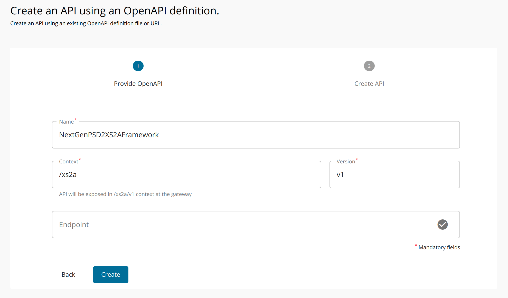
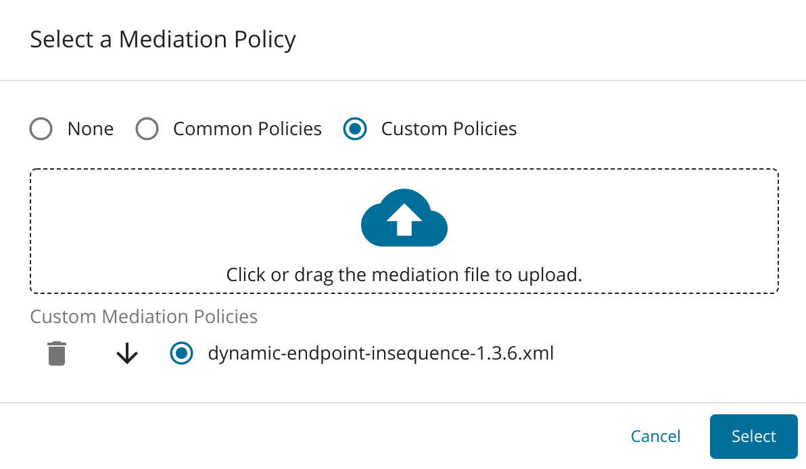

This page provides instructions to deploy the NextGenPsd2XS2AFramework API. WSO2 Open Banking Berlin Toolkit 
provides the Account Information Service (AIS), Payment Initiation Service (PIS), and Confirmation on the Availability 
of Funds Service (FCS) via the NextGenPSD2XS2AFramework API. 

1. Sign in to the API Publisher Portal at `https://<APIM_HOST>:9443/publisher` with the creator/publisher privileges.

    

2. In the homepage, go to **REST API** and select **Import Open API**. 

3. Select **OpenAPI File/Archive**. 

4. Click **Browse File to Upload** and select the `<APIM_HOME>/<OB_APIM_TOOLKIT_HOME>/repository/resources/apis/berlin.group.org/PSD2API_1.3.6/psd2-api_1.3.6_20200327.yaml` file.

5. Click **Next**.

6. Set the context to `/xs2a`.

7. Remove the existing endpoint configuration and leave the field empty. 

8. Click **Create** to create the API. 

9. After the API is successfully created, go to **Portal Configurations** using the left menu panel. 

10. Select **Subscriptions** from the left menu pane and set the business plan to **Unlimited: Allows unlimited requests**. 

11. Click **Save**.

12. Select **Runtime** from the left menu pane.

13. Toggle the **Schema Validation** button to enable Schema Validation. 

14. Click the **Edit** button under **Request > Message Mediation**. 

15. Select the **Custom Policy** option.

16. Upload the `<APIM_HOME>/<OB_APIM_TOOLKIT_HOME>/repository/resources/apis/berlin.group.org/PSD2API_1.3.6/dynamic-endpoint-insequence-1.3.6.xml` insequence file. 

17. Click **Select**.

18. Scroll down and click **SAVE**.

19. Use the left menu panel and go to **API Configurations > Endpoints**.

    

20. Add a **Dynamic Endpoint**. 

21. Go to **Deployments** using the left menu pane.

    

22. Select the API Gateway type, in this scenario, it is **Default**. 

23. Click **Deploy**.

24. Go to **Overview** using the left menu pane.

    

25. Click **Publish**. 